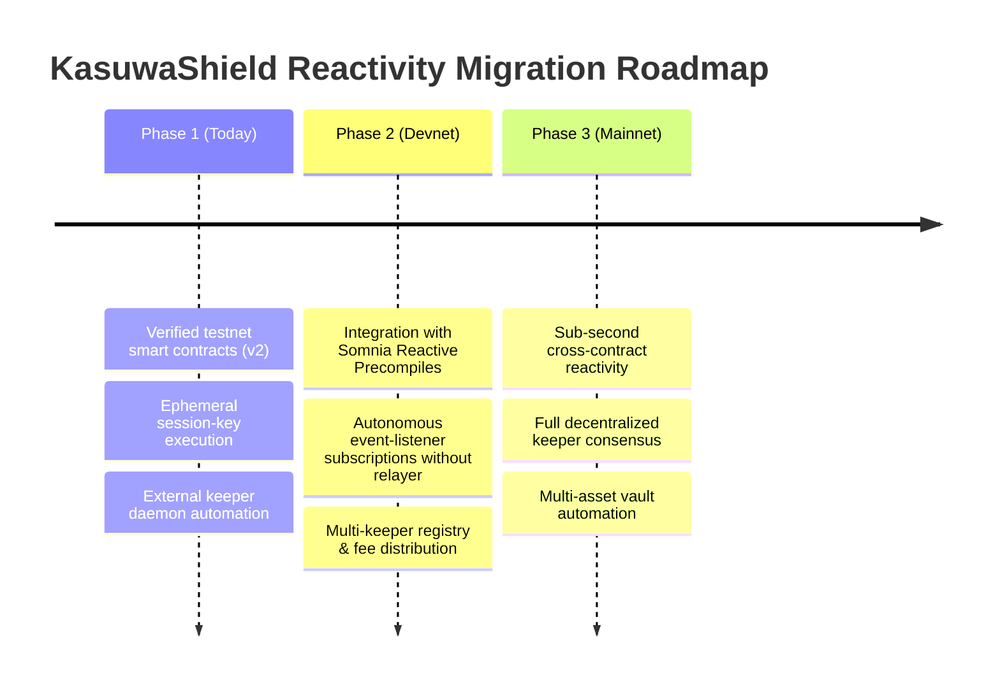

# KASUWASHIELD — DECENTRALIZED KEEPER NETWORK SPECIFICATION

**Document Version**: 1.0.0  
**Target Network**: Somnia Network (Shannon Testnet Chain ID: `50312` → Somnia Mainnet)  
**Smart Contracts**: `KasuwaPolicy v2` (`0xbd2a...550a`), `KasuwaExecutor` (`0x80Ac...4B7c69c`), `KasuwaReactiveHandler` (`0x7eAf...F3213`)  
**Status**: Specification & Reference Implementation

---

## 1. Executive Summary

In traditional event contract trading, short-duration binary derivatives (e.g. 15-minute or 1-hour expiry windows) expire, requiring manual user intervention to re-hedge spot portfolio exposure. KasuwaShield automates continuous rollover through **scoped session keys** authorized under **EIP-7702 delegation rules**.

This specification outlines the **Decentralized Keeper Network**: the permissionless, economically incentivized layer responsible for executing policy-bounded rollovers on-chain when event windows settle.

```text
┌────────────────────────────────────────────────────────────────────────┐
│                     DECISION & EXECUTION LIFECYCLE                     │
├───────────────────┬────────────────────────────────┬───────────────────┤
│ 1. DreamDEX Event │ 2. Reactive Notification       │ 3. Keeper Network │
│    Settlement     │    Handler (On-Chain)          │    Execution      │
├───────────────────┼────────────────────────────────┼───────────────────┤
│ Binary contract   │ KasuwaReactiveHandler.sol      │ Open keeper pool  │
│ matures at t=15m. │ verifies settlement outcome    │ detects window &  │
│ Payouts credited  │ & emits RolloverWindowOpen.    │ calls execute-    │
│ to user account.  │ Idempotency guard armed.       │ AutoRoll on-chain.│
└───────────────────┴────────────────────────────────┴───────────────────┘
```

---

## 2. Reference Implementation vs. Decentralized Protocol

To maintain complete engineering truthfulness, the protocol distinguishes between what is running live on Somnia Shannon testnet today and the production mainnet architecture:

| Component | Reference Implementation (Testnet Live Today) | Decentralized Keeper Protocol (Mainnet Spec) |
|---|---|---|
| **Execution Trigger** | Off-chain keeper daemon (`scripts/keeper-daemon.ts`) monitoring `RolloverWindowOpen` | Decentralized network of competing, staked keeper nodes |
| **Transaction Signer** | Authorized ephemeral session key holding gas funds (`0.02 STT`) | Staked keeper executing via user session authorization with gas compensation |
| **Settlement Intake** | Script relayer (`scripts/trigger-reactive-rollover.ts`) invoking `onMarketSettled` | Native Somnia on-chain reactive precompile autonomous dispatch |
| **Economic Settlement** | Fixed policy budget deduction on-chain | Dynamic gas reimbursement + priority execution tip |

---

## 3. Game-Theoretic Economic & Incentive Model

Keepers perform computational work and commit gas capital to advance user protection windows. The economic model guarantees profitable keeper participation while enforcing fail-closed protection for policyholders.

### 3.1 Keeper Fee Formulation

For each successful auto-roll execution, the keeper receives a gas compensation plus an execution bounty deducted from the policy's pre-approved `remainingBudgetUSD`:

$$\text{Fee}_{\text{keeper}} = (\text{GasUsed} \times \text{GasPrice}_{\text{effective}} \times \mu) + \text{Tip}_{\text{base}}$$

Where:
* $\text{GasUsed}$: Actual EVM gas consumed by `KasuwaExecutor.executeAutoRoll` (typically $280,000 - $340,000$ gas).
* $\text{GasPrice}_{\text{effective}}$: Somnia sub-cent gas price in USDso equivalents ($< \$0.001$).
* $\mu = 1.25$: 25% safety multiplier on gas volatility compensation.
* $\text{Tip}_{\text{base}} = 0.05\text{ USDso}$: Fixed base execution incentive per 15-minute window.

### 3.2 Maximum Bounded Deductions
Every policy specifies an immutable `maxNotionalUSD` and `budgetLimitUSD` inside `KasuwaPolicy.sol`. If:

$$\text{Fee}_{\text{keeper}} + \text{Cost}_{\text{hedge}} > \text{Policy}.\text{remainingBudgetUSD}$$

The contract **fails closed** (`PolicyBudgetExceeded()`), terminating further rollovers without putting user principal at risk.

---

## 4. Staking, Slashing & Anti-Equivocation Rules

To prevent front-running, griefing, or sluggish execution during fast-moving market crashes, keepers must register and stake collateral in the `KasuwaKeeperRegistry`.

### 4.1 Staking Requirements
* **Minimum Bond**: $100\text{ USDso}$ staked in the registry contract.
* **Unbonding Period**: 7 days (prevents flash-slashing evasion).

### 4.2 Slashing Conditions

| Infraction | Detection Mechanism | Penalty |
|---|---|:---:|
| **Sluggish Rollover (>60s Delay)** | `block.timestamp > RolloverWindowOpen.timestamp + 60` | $5\text{ USDso}$ burned from stake; window opens to public fallback pool |
| **Invalid State Submission** | Attempting to call `executeAutoRoll` with stale or unverified marketId | Transaction reverts; keeper forfeits gas fee |
| **Front-running / Sandwich Griefing** | Attempting to execute outside slippage ceiling | Reverts via `PolicySlippageExceeded()` guard |

---

## 5. Frontrunning & MEV Mitigation

Because DreamDEX event contract rollovers occur at predictable 15-minute intervals, MEV protection is enforced deterministically:

1. **On-Chain Slippage Bounding**: `KasuwaPolicy.validateOrder()` asserts that the executed hedge order price does not exceed `maxSlippageBps` (typically 500 bps / 5%). Any sandwich transaction manipulating the pool orderbook forces the transaction to revert.
2. **Idempotent Multi-Window Lock**: `KasuwaReactiveHandler.processedMarkets[marketId]` ensures that a settlement window cannot be processed twice or re-entered by competing front-runners.
3. **Sub-Second Block Finality**: Somnia's sub-second block architecture minimizes mempool residency time, preventing typical L1 gas-auction front-running.

---

## 6. Migration Path to Native Somnia Reactivity

KasuwaShield's architectural evolution is designed to replace off-chain keeper relaying with native EVM precompile reactivity as Somnia infrastructure matures:



### Phase 1: Reference Keeper Daemon (Current Testnet)
* External keeper process tracks Somnia Shannon testnet blocks.
* Listens for `RolloverWindowOpen` event emitted by `KasuwaReactiveHandler.sol`.
* Signs and broadcasts `executeAutoRoll` from an authorized ephemeral session key.
* **Status**: 100% verified live on-chain (`scripts/keeper-daemon.ts`, `scripts/trigger-reactive-rollover.ts`).

### Phase 2: Somnia Reactive Precompile Integration (Target Testnet)
* `KasuwaReactiveHandler.sol` registers an on-chain event trigger directly with Somnia's reactive execution precompile.
* Upon DreamDEX settlement event emission, the precompile dispatches an autonomous callback into `KasuwaExecutor.sol`.
* External keeper relaying is bypassed for the settlement intake.

### Phase 3: Decentralized Mainnet Production
* Open permissionless keeper pool competes for execution bounties via the `KasuwaKeeperRegistry`.
* Atomic cross-contract execution against production DreamDEX CLOB orderbooks.

---

## 7. Verification Artifacts

* **Storage Slot 0 Wiring Proof**: [`EXECUTOR_POLICY_WIRING_PROOF.md`](./EXECUTOR_POLICY_WIRING_PROOF.md)
* **Slither Static Security Audit (0/0/0)**: [`SLITHER_SECURITY_AUDIT.md`](./SLITHER_SECURITY_AUDIT.md)
* **Vulnerability Disclosure & v2 Fix**: [`SECURITY.md`](./SECURITY.md)
* **Live Testnet Keeper Proof Tx**: `0x5b49c1c9...` (Roll #1), `0x3dfd8120...` (Roll #2), `0x9bad9c30...` (Roll #3)
* **Session-Key Executed Roll Tx**: `0x04a4bccb...` (Signed by ephemeral session key `0x96cb...cdDF`)
* **Reactive Settlement Tx**: `0xcc73aa66...` (Emits `MarketSettlementDetected`, `PayoutRedeemed`, `RolloverWindowOpen`)
