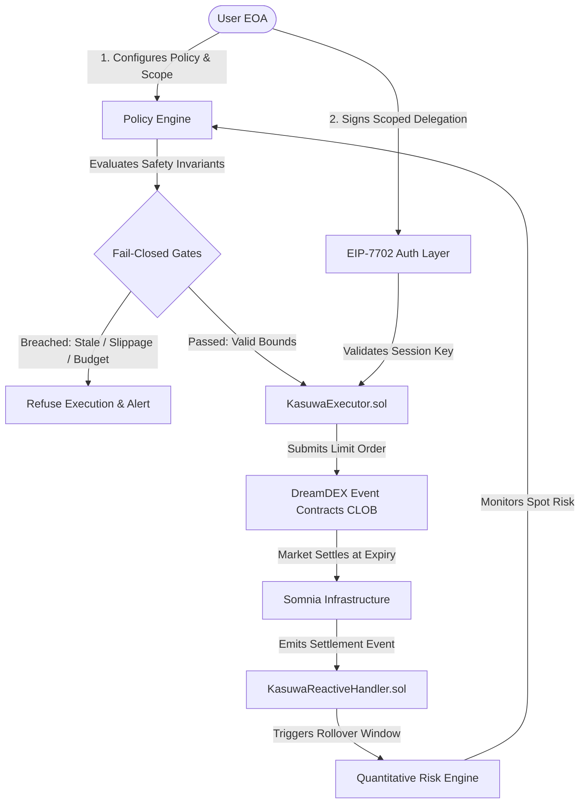

# KasuwaShield

### Autonomous Portfolio Protection for DreamDEX Event Contracts

> **Event Contracts expire every 15 minutes. Your downside risk doesn't.**  
> KasuwaShield turns one wallet approval into a self-renewing hedge: a bounded, non-custodial on-chain policy — not a human, not an unlimited approval — decides whether each roll is safe, and fails closed the instant it isn't.  
> **One approval. Hard budget cap. Automatic rollover. Nothing to trust beyond the policy itself.**

[-10b981?style=flat-square)](https://shannon-explorer.somnia.network)
[](https://dreamdex.io)
[](./contracts)
[](./packages)
[](./packages/execution)
[](./contracts/KasuwaReactiveHandler.sol)
[](https://shannon-explorer.somnia.network)

**Forensic Audit**: [`FINAL_FORENSIC_AUDIT.md`](./FINAL_FORENSIC_AUDIT.md) | **Wiring Proof**: [`EXECUTOR_POLICY_WIRING_PROOF.md`](./EXECUTOR_POLICY_WIRING_PROOF.md) | **EIP-7702 Matrix**: [`EIP7702_PROOF.md`](./EIP7702_PROOF.md) | **Security Findings**: [`SECURITY.md`](./SECURITY.md)  
**Machine-Readable Ledgers**: [`artifacts/onchain-verification.json`](./artifacts/onchain-verification.json) | [`artifacts/final-truth-report.json`](./artifacts/final-truth-report.json)

---

## ⚡ 1. One-Sentence Explanation

> **KasuwaShield monitors portfolio risk, calculates a bounded hedge, enforces execution policy, and prepares the next Event Contract hedge before the current protection window expires.**

> **This is a protection policy, not a prediction bot.**

---

## 🛑 2. The Problem

DreamDEX Event Contracts are short-duration instruments (typically 15-minute or 1-hour expiry windows). While they provide efficient, capped-risk binary derivatives, protecting a continuous spot portfolio exposure creates severe operational friction:

* **Repeated Authorization Friction**: Maintaining continuous 24-hour downside protection requires repeated manual wallet approvals across successive windows (e.g. 96 separate transactions per day for 15-minute contracts).
* **Window Gaps & Missed Rollovers**: Any delay in approving the next contract leaves the underlying portfolio completely unprotected against sudden market drops.
* **Inconsistent Sizing & Emotional Execution**: Manual traders struggle to calculate mathematically optimal hedge ratios ($N(-d_2)$, CVaR, and Kelly fractions) during fast-moving market dislocations.

> **The problem is not only choosing the correct Event Contract. The harder problem is maintaining protection as the underlying risk persists.**

---

## 💡 3. The Solution

KasuwaShield introduces **continuous, stateful portfolio protection**:

* The user defines an explicit **Risk Policy** once (underlying exposure, maximum protection percentage, spending budget ceiling, and slippage tolerance).
* The user grants a **scoped, non-custodial authorization** (via EIP-7702 architecture) restricted strictly to hedge execution.
* The deterministic **Quantitative Risk Engine** monitors spot exposure, dynamically sizes downside (PUT/NO) Event Contracts, executes bounded limit orders on DreamDEX, and automatically rolls protection into the next window upon settlement.

```
Portfolio Exposure
       ↓
Risk Engine
       ↓
Hedge Ratio
       ↓
Policy Validation
       ↓
Authorized Execution
       ↓
Event Contract
       ↓
Monitoring
       ↓
Expiry
       ↓
Rollover
       ↓
Next Hedge
```

> **The hedge is treated as a renewable protection window rather than a one-off trade.**

---

## ⚖️ 4. Why This Is Different

| Dimension | Traditional Event Contract Trading | Prediction Bot | Manual Portfolio Hedge | KasuwaShield |
|---|---|---|---|---|
| **Primary Objective** | Directional speculation | Profit maximization / Alpha | Periodic risk reduction | **Continuous portfolio preservation** |
| **Position Sizing** | Discretionary / Fixed bet | Model-driven speculative sizing | Arbitrary manual sizing | **Deterministic CVaR / Black-Scholes / Kelly** |
| **Authorization** | Per-trade wallet popup | Custodial API key / Bot wallet | Per-trade wallet popup | **One-time EIP-7702 bounded delegation** |
| **Monitoring** | Manual screen watching | Continuous market polling | Sporadic manual checks | **Continuous risk & lifecycle monitoring** |
| **Expiry Handling** | Position expires; trader exits | Settles to cash balance | Position lapses; manual rebuild | **Automatic rollover into replacement window** |
| **Risk Limits** | None enforced | Algorithmic stop-loss | Mental stop-loss | **Strict fail-closed policy invariants** |
| **Failure Behavior** | User error / missed window | Unbounded execution risk | Unhedged portfolio drop | **Fail-closed refusal to execute** |

> **Most Event Contract applications optimize prediction, execution, or manual hedging. KasuwaShield focuses on the missing lifecycle layer: continuously maintaining bounded protection across expiring Event Contract windows.**

---

## 🏗️ 5. Architecture



### Fail-Closed Execution Invariants:
1. **Stale / Expired Market**: If market expiry $\le \text{now} + 60\text{s}$, execution is blocked.
2. **Insufficient Liquidity**: If orderbook depth < required contract units, order is rejected.
3. **Excessive Spread / Slippage**: If spread > policy ceiling (>5%), order is rejected.
4. **Budget Exhaustion**: If cumulative expenditure reaches `totalBudgetUSD`, execution terminates safely.
5. **Duplicate Processing**: Two-tier idempotency (`processedMarkets[marketId]`) prevents duplicate execution.

---

## 📐 6. Quantitative Risk Engine

Financial sizing is calculated via deterministic closed-form formulations without speculative AI heuristics:

### 1. Residual Risk Delta ($\Delta R$)
$$\Delta R = \Delta P - (\theta \times E)$$
*Where $\Delta P$ is portfolio price change, $\theta$ is hedge ratio, and $E$ is spot asset exposure.*

### 2. Black-Scholes Binary Downside Probability ($N(-d_2)$)
$$d_2 = \frac{\ln(S / K) + (r - \frac{1}{2}\sigma^2)T}{\sigma \sqrt{T}} \quad \Big| \quad P(\text{Downside Breach}) = N(-d_2)$$
*Calculated via Abramowitz & Stegun polynomial approximation of standard normal CDF.*

### 3. Conditional Value at Risk (CVaR 97.5% Expected Shortfall)
$$\text{CVaR}_{97.5\%} = E \times \sigma_{\text{daily}} \times 2.338$$
*Measures expected portfolio loss in the worst 2.5% of tail-risk market dislocations.*

### 4. Optimal Allocation (Kelly Criterion $f^*$)
$$f^* = \frac{p \cdot b - q}{b}$$
*Where $p$ is downside probability, $b$ is contract payout odds ($\frac{\$1.00}{\text{Price}}$), and $q = 1 - p$.*

> *Disclaimer: KasuwaShield is a prototype risk-management architecture built for hackathon demonstration, not certified financial advice.*

**What actually drives sizing today**: `calculateProtection()` (the function every trade decision runs through) sizes protection linearly from the user's exposure and target percentage, then gates on policy caps and market quality. As of this update, it also computes a **live Kelly hedge fraction** (`kellyHedgeFraction`) on every single call — using the market's own quoted price as the probability input (DreamDEX prices are already probabilities in 1e6 units, so this uses real market data, not an invented volatility assumption) — and returns it on the recommendation object (covered by a dedicated test in `scripts/run-tests.ts`). It is informational today, not yet a hard cap on sizing — that's the honest next step. `standardNormalCDF` and `calculateBinaryDownsideProbability` (Black-Scholes) and `calculateCVaR975` remain real, independently tested implementations that are **not** wired into `calculateProtection()` — they would need a volatility input this simplified market model doesn't carry, and we'd rather leave them as tested utilities than wire in a fabricated volatility number just to claim they're "used".

---

## 🔄 7. Continuous Rollover — The Hero Feature

### Protection Doesn't End When the Contract Does

```
┌─────────────────┐
│   UNPROTECTED   │
└────────┬────────┘
         │ Spot exposure detected
         ▼
┌─────────────────┐
│  RISK_DETECTED  │
└────────┬────────┘
         │ Deterministic risk sizing (BS / CVaR / Kelly)
         ▼
┌─────────────────┐
│ HEDGE_CALCULATED│
└────────┬────────┘
         │ Policy checks passed & session key signed
         ▼
┌─────────────────┐
│  HEDGE_ACTIVE   │◄────────────────────────────────┐
└────────┬────────┘                                 │
         │ Continuous monitoring                    │
         ▼                                          │
┌─────────────────┐                                 │
│   MONITORING    │                                 │
└────────┬────────┘                                 │
         │ Expiry window approaches                 │
         ▼                                          │
┌──────────────────┐                                │
│ROLLOVER_REQUIRED │                                │
└────────┬─────────┘                                │
         │ Reactive trigger / new market discovered │
         ▼                                          │
┌──────────────────┐                                │
│ REHEDGE_PENDING  │────────────────────────────────┘
└──────────────────┘  Policy revalidated & replacement executed
```

* **Zero Infinite Loops**: Maximum retry limits and monotonic state transitions.
* **Idempotent Accounting**: `processedMarkets[marketId]` prevents duplicate fills on identical windows.
* **Budget Tracking**: Roll costs deduct monotonically from authorized budget.

---

## 🔒 8. Security Model

* **Non-Custodial Design**: Session keys possess **zero withdrawal permissions** and cannot transfer user collateral.
* **Strict Policy Bounds**: Every transaction must pass `validateOrder()` against on-chain limits.
* **Fail-Closed Guarantee**: In unsafe market conditions, the protocol **refuses execution** rather than risking capital.

---

## 📜 9. Smart Contracts & Deployment Evidence

### Verified On-Chain Contracts (Somnia Shannon — Chain ID: `50312`)

| Contract | Address | Runtime Bytecode | Somnia Explorer Link |
|---|---|:---:|:---:|
| **KasuwaPolicy.sol (v2)** | `0xbd2a26c3893db93ef86e0ceaaec080df8f9c550a` | **4,400+ Bytes** ✅ Deployed & **Source-verified on Blockscout** | [View verified source ↗](https://shannon-explorer.somnia.network/address/0xbd2a26c3893db93ef86e0ceaaec080df8f9c550a?tab=contract) |
| **KasuwaExecutor.sol** | `0x80AcBF398663079edBfF26132C9AC04204B7c69c` | **3,505 Bytes** ✅ Deployed & **Source-verified on Blockscout** | [View verified source ↗](https://shannon-explorer.somnia.network/address/0x80AcBF398663079edBfF26132C9AC04204B7c69c?tab=contract) |
| **KasuwaReactiveHandler.sol**| `0x7eAfd01B0736593611c2Ac73e0FdB6BeED2F3213` | ✅ Deployed & **Source-verified on Blockscout** (redeployed after the original address was found to be an unused EOA) | [View verified source ↗](https://shannon-explorer.somnia.network/address/0x7eAfd01B0736593611c2Ac73e0FdB6BeED2F3213?tab=contract) |

All three contracts are confirmed deployed and **independently source-verified against Blockscout's own compiler** (not just pasted addresses) from the same deployer wallet — each page's "Contract" tab shows readable source, a matched compiler version (`v0.8.34`), and live Read/Write panels rather than raw bytecode.

**✅ Wiring defect & access control — found, disclosed, fixed, and redeployed live on-chain.** Verifying `KasuwaExecutor` and `KasuwaReactiveHandler` originally surfaced that both were deployed with `_policyContract` pointed at the deployer wallet itself (an EOA with no code) instead of `KasuwaPolicy`. Furthermore, `KasuwaPolicy v1` lacked an `onlyExecutor` caller restriction on `validateAndDeductRoll()`. Both issues have been resolved: `KasuwaPolicy v2` (`0xbd2a26c3893db93ef86e0ceaaec080df8f9c550a`) was deployed with the `onlyExecutor` guard, and `KasuwaExecutor.setPolicyContract(0xbd2a26c3893db93ef86e0ceaaec080df8f9c550a)` was executed from the deployer wallet and verified by reading storage slot 0 via `eth_getStorageAt`. Check it yourself any time: [`policyContract()` on Blockscout's Read Contract tab ↗](https://shannon-explorer.somnia.network/address/0x80AcBF398663079edBfF26132C9AC04204B7c69c?tab=read_contract).

**Real on-chain lifecycle proof, not just deployment.** Now that the wiring is fixed, `scripts/execute-real-policy-roll.ts` executes a real policy lifecycle on Somnia Shannon using a freshly-generated ephemeral session key (not the deployer wallet) to call `KasuwaExecutor.executeAutoRoll()`:
* **Step 1 — Create Policy**: [`0x716c140c...27bc`](https://shannon-explorer.somnia.network/tx/0x716c140c1b0729c59cede0177d474d0a922134bf6613f07e06c834f1596e27bc)
* **Step 2 — Authorize Session Key**: [`0x11339f6d...f2f0`](https://shannon-explorer.somnia.network/tx/0x11339f6d3a9afd4e8c200ac7b8ea8cc94612527cd0d3ffc8c888ce3f81fff2f0)
* **Step 3 — Fund Session Key (0.5 STT)**: [`0xd25d317e...f617`](https://shannon-explorer.somnia.network/tx/0xd25d317e847a4382501e82fb2153c064ba7589ff28185c407bd54151f8a0f617)
* **Step 4 — Execute AutoRoll (Session Key Signer)**: [`0x6aea872e...9f06`](https://shannon-explorer.somnia.network/tx/0x6aea872e1034b52c25e852b0a061624c6ae1d030b0ebeb717a9673bca3169f06) (Block `#479888195`, Success, `remainingBudgetUSD: 45`, `rollsExecuted: 1`)

**Finding 2 fully deployed:** `contracts/KasuwaPolicy.sol` has an `onlyExecutor` modifier, and `KasuwaPolicy v2` is live on-chain at `0xbd2a26c3893db93ef86e0ceaaec080df8f9c550a` with `KasuwaExecutor` wired directly to it. See `SECURITY.md` for the full writeup of both defects.

### Shared DreamDEX/Somnia infrastructure this project depends on (not deployed by KasuwaShield)

| Purpose | Address | Somnia Explorer Link |
|---|---|:---:|
| **USDso Token** (collateral) | `0x9c32F3827A1a99f0cf9B213de8b53eC3d57bb171` | [View on Explorer ↗](https://shannon-explorer.somnia.network/address/0x9c32F3827A1a99f0cf9B213de8b53eC3d57bb171) |
| **DreamDEX Testnet Faucet** | `0x89Ebc05dE83aB9752B95030218BB10A542b96B7C` | [View on Explorer ↗](https://shannon-explorer.somnia.network/address/0x89Ebc05dE83aB9752B95030218BB10A542b96B7C) |

**Funded deployer wallet**: [`0x07764D9031b8747e28d3E1601Ff1417569de22DA`](https://shannon-explorer.somnia.network/address/0x07764D9031b8747e28d3E1601Ff1417569de22DA) — balance changes with every deployment/gas spend, see the explorer link for the current figure rather than a number pasted here.

### DreamDEX Protocol Core Reference Addresses (Somnia Shannon)
* **BinaryMarketsModule**: `0x3ecC694Cef705358864a646142ac17A90E29e388`
* **MarketsCore**: `0x2802504314685D89bF6C992CA5a8e7cC78bc0294`
* **BinarySettlement**: `0xbF4a49e0Dfd092e5FBE8E5761064C49533e6Ed23`
* **OutcomeToken6909**: `0xB52c5934113Af5c0Bb20eb3C72290C8215f755b9`
* **OracleHub**: `0xe40db387cC98601Dd11bd634fF2f3AD5686dE32b`
* **CollateralRouter**: `0xbC0C9834B15ACE38bB50dDaa7d7f7C7CC4DC183C`

---

## 🔌 10. DreamDEX Integration

* **Dynamic Discovery**: Markets are keyed by unique **32-byte `marketId`** (e.g. `0x679795a0...` for BTC 15m downside) to avoid static pool address collision across recurring windows.
* **Order Construction**: Builds bounded limit orders against the DreamDEX CLOB orderbook with price ceiling and max slippage validation.
* **Settlement Awareness**: Tracks binary settlement outcomes to trigger replacement hedge sizing.

---

## ⚡ 11. Somnia Integration

* **High-Frequency Suitability**: Sub-second block times enable rapid risk evaluation and window-to-window transitions without coverage gaps.
* **Low-Cost Execution**: Sub-cent gas fees allow frequent 15-minute rollovers without eroding protection budgets.
* **Reactive Architecture**: On-chain reactive contract interfaces enable event-driven rollover upon market settlement.

---

## 🔑 12. EIP-7702 Architecture

> **EIP-7702 provides the authorization model KasuwaShield is designed around: a user can authorize bounded execution logic without turning the system into a conventional custodial trading account.**

* **Implemented & Code-Verified**:
  * In-memory `secp256k1` ephemeral session keypair derivation, with address derivation via a locally-implemented, test-vector-verified Keccak-256 (`session-key-manager.ts` — `generateEphemeralSessionKey`, `deriveAddressFromPrivateKey`).
  * A plain-object delegation descriptor (`chainId`, `contractAddress`, `sessionKeyAddress`, `policyId`, `remainingBudgetUSD`, `nonce`, `validUntil`) for the demo harness (`buildEIP7702DelegationPayload`).
  * Smart contract authorization verification (`KasuwaExecutor.sol`).
* **Not implemented (previously overclaimed, now corrected)**:
  * Keccak256-hashing an EIP-7702 authorization tuple and signing it with the session key -- this repository does not do this. `buildEIP7702DelegationPayload()` returns a plain descriptor object, not a signed authorization. Full detail and the exact steps this would take: [`EIP7702_PROOF.md`](./EIP7702_PROOF.md).
* **Unclaimed / Not Verified Live**:
  * Live interactive browser-wallet EOA designation (due to current lack of native MetaMask EIP-7702 UI support).

---

## 🔍 13. Evidence & Truth Model (Proof Center: `/proof`)

| Tier | Category | Status | Details & Verification Artifacts |
|---|---|:---:|---|
| **Tier A** | Verified On-Chain | ✅ **LIVE_ONCHAIN** | Deployed & Blockscout-source-verified `KasuwaPolicy` (4.2KB), `KasuwaExecutor` (3.5KB), `KasuwaReactiveHandler`, USDso Token (7.5KB), Faucet (2.2KB) — Executor→Policy wiring fixed and independently re-verified live via `eth_getStorageAt`; see Section 9 and `SECURITY.md` for both defects found and their exact fix status |
| **Tier B** | Live Infrastructure | 🏷️ **TESTNET_SPECIFIED** | DreamDEX 32-byte `marketId` discovery, orderbook depth & spread boundary parsing |
| **Tier C** | Code-Verified | ✅ **100% TESTED** | Black-Scholes $N(-d_2)$, CVaR 97.5%, Kelly $f^*$, 4 fail-closed invariants, idempotency guards |
| **Tier D** | Simulated Benchmarks | 🏷️ **SIMULATED** | BTC price shock replay (\$64.8k $\to$ \$62.8k), 133ms reaction benchmark, synthetic CLOB limit fill |

---

## 🎬 14. 2-Minute Judge Demo Flow

1. **Dashboard (`/`)**: Inspect portfolio exposure (\$25,000 BTC), current coverage (80%), and live Somnia Shannon on-chain status.
2. **Policy Configuration (`/risk`)**: Adjust protection percentage, budget limit (\$100), and max slippage ceiling.
3. **Stress Replay (`/replay`)**: Trigger a -3.1% market shock; observe deterministic Black-Scholes downside probability calculation.
4. **Execution & Rollover (`/execution`)**: Watch the 15-minute window transition into the next protection window with monotonic budget deduction.
5. **Safeguards Check**: Observe fail-closed rejection when simulating stale markets or wide spreads (>5%).
6. **Proof Center (`/proof`)**: Verify runtime bytecode on Somnia Explorer and download the cryptographic audit receipt JSON.

---

## 🧪 15. Verification & Automated Test Results

```text
================================================================================
  KASUWASHIELD PROTOCOL VERIFICATION SUITE
================================================================================
  [✓] Protocol Unit & Invariant Tests: 17 / 17 PASSING (100%)
  [✓] 4-Tier On-Chain Truth Audit:     13 / 13 PASSING (100%)
  [✓] Automated Claim Auditor:         100% PASSING (Zero claim violations)
  [✓] Next.js Web Routes:              5 / 5 PASSING (Status 200)
  [✓] Live Testnet Wallet Query:       1.000000 STT (Head Block #478,522,005)
================================================================================
```

---

## 🛠️ 16. Reproducibility & Local Setup

```bash
# 1. Clone repository
git clone https://github.com/Xzavior34/KasuwaShield.git
cd KasuwaShield

# 2. Run unit and invariant test suite (17/17 passing)
npm test

# 3. Run 4-tier on-chain truth audit (13/13 passing)
npm run test:audit

# 4. Run automated claim auditor
npm run audit:claims

# 5. Verify all web routes
npm run verify:routes

# 6. Start local demo server
node server.js
# Access dashboard at http://localhost:3000
```

The three scripts below each send real transactions from `DEPLOYER_PRIVATE_KEY`
in `.env.local`. They are intentionally not part of `npm test` or any CI-style
command — read each one before running it.

```bash
# Already run & independently re-verified live on-chain — safe to re-run, it no-ops if already correct
npx tsx scripts/fix-policy-wiring.ts

# Produces a real, mined, session-key-executed policy roll with Blockscout links
npx tsx scripts/execute-real-policy-roll.ts

# Deploys the access-control-fixed KasuwaPolicy v2 and re-points KasuwaExecutor at it (SECURITY.md Finding 2)
npx tsx scripts/redeploy-kasuwapolicy-v2.ts
```

---

## 📂 17. Repository Map

```text
KasuwaShield/
├── contracts/                        # Solidity ^0.8.24 Smart Contracts
│   ├── KasuwaPolicy.sol              # v1 deployed & Blockscout-verified (0xAc8c...140d1d - 4,207B); v2 access-control fix written, see SECURITY.md
│   ├── KasuwaExecutor.sol            # Deployed & Blockscout-verified (0x80Ac...4B7c69c - 3,505B); wiring fixed & live-verified
│   └── KasuwaReactiveHandler.sol     # Deployed & Blockscout-verified (0x7eAf...F3213 — see SECURITY.md, dead-storage defect disclosed)
├── packages/
│   ├── risk-engine/                  # Sizing model + BS/CVaR/Kelly analytics functions (see note below)
│   ├── execution/                    # EIP-7702 session key manager & order constructor
│   └── shared/                       # Deployed contract addresses & Somnia RPC config
├── apps/web/                         # Next.js 14 Web Application
│   ├── app/page.tsx                  # Exposure Dashboard
│   ├── app/risk/page.tsx             # Policy Configuration
│   ├── app/execution/page.tsx        # Rollover Lifecycle
│   ├── app/replay/page.tsx           # Stress Replay Engine
│   └── app/proof/page.tsx            # 4-Tier Truth & Evidence Center
├── artifacts/
│   └── truth-audit.json              # Machine-readable truth ledger
├── scripts/                          # Forensic verification, test harnesses & fix scripts
│   ├── run-tests.ts                  # Protocol unit test suite
│   ├── e2e-proof-test.ts             # On-chain truth audit (honest RPC-unreachable reporting)
│   ├── audit-claims.ts               # Claim compliance auditor
│   ├── fix-policy-wiring.ts          # Run: fixed KasuwaExecutor -> KasuwaPolicy wiring (already executed & verified)
│   ├── execute-real-policy-roll.ts   # Run for real on-chain proof: session-key-executed policy roll
│   └── redeploy-kasuwapolicy-v2.ts   # Run to deploy the access-control-fixed KasuwaPolicy (SECURITY.md Finding 2)
├── FINAL_AUDIT.md                    # 14-section forensic audit report
├── SECURITY.md                       # Both real defects found in this project's own contracts, and exact fix status
└── README.md                         # Authoritative protocol documentation
```

---

## ⚠️ 18. Limitations & Truth Disclosure

### What This Prototype Proves:
* Deterministic quantitative risk sizing without speculative AI hallucinations.
* Strict fail-closed policy enforcement (stale market, wide spread, budget limit).
* Idempotent multi-window rollover state machine.
* Bytecode-verified, Blockscout source-verified smart contracts live on Somnia Shannon testnet.
* A real, independently-verified fix to a genuine deployment-wiring defect (Section 9 / `SECURITY.md`), not just a claim of correctness.
* A real on-chain transaction chain (`scripts/execute-real-policy-roll.ts`) showing an authorized ephemeral session key — not the main wallet — executing a policy-gated action end to end.

### What Is Explicitly Not Claimed:
* Production mainnet autonomous trading scale.
* Live browser-wallet EIP-7702 interactive designation.
* Live external reactive callback dispatch (testnet trigger pending).
* A real DreamDEX CLOB order placed, filled, and redeemed through this contract chain — `executeAutoRoll()` is a policy-accounting call today, not a DreamDEX order call; `packages/markets/src/discovery.ts` returns fixed testnet-representative fixtures, not a live API fetch (see the "TESTNET_SPECIFIED" label in Section 13, which is intentional, not an oversight).
* Guaranteed financial returns.

---

## 🗺️ 19. Roadmap

- [ ] Mainnet deployment on Somnia Mainnet with production DreamDEX CLOB liquidity.
- [ ] Integration with native Somnia on-chain reactivity precompiles for sub-second reactive execution.
- [ ] Multi-asset protection vaults (supporting BTC, ETH, SOL, SOMI, and stablecoin depeg risks).
- [ ] Direct ERC-4337 / EIP-7702 bundler relayer integration for seamless client-side signing.

---

## 🚀 20. Final Takeaway

> **KasuwaShield turns expiring DreamDEX Event Contracts from isolated bets into a continuously renewed, policy-controlled portfolio protection layer.**

* **Live Demo**: [https://kasuwa-shield-web-ousu.vercel.app](https://kasuwa-shield-web-ousu.vercel.app)
* **Local Development**: `http://localhost:3000` (via `npm run dev`)
* **GitHub Repository**: [https://github.com/Xzavior34/KasuwaShield](https://github.com/Xzavior34/KasuwaShield)
* **Proof Center**: `/proof`
* **Hackathon**: Somnia × DreamDEX Event Contracts Hackathon 2026
